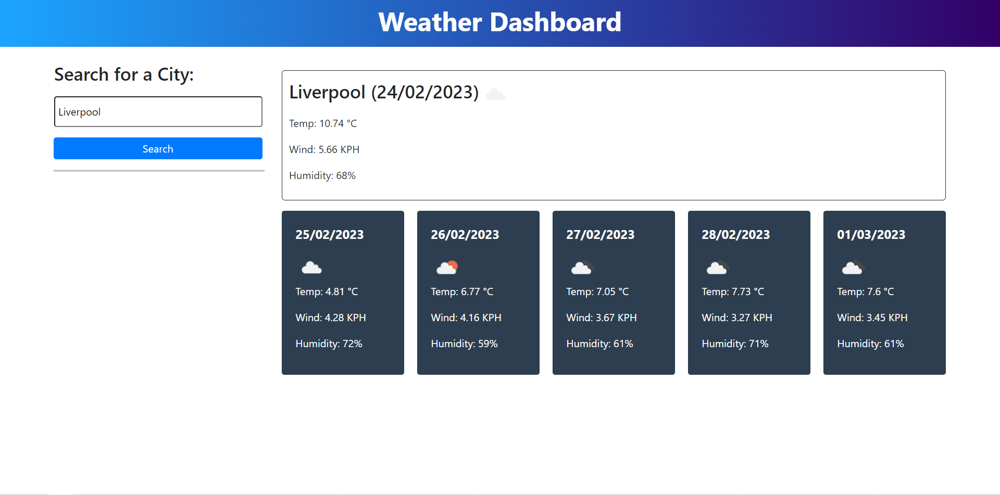

<h1 align="center">Weather Dashboard</h1>

The Weather Dashboard is a web application that allows users to see the weather outlook for multiple cities. The dashboard features dynamically updated HTML and CSS and retrieves weather data for cities using the 5 Day Weather Forecast API.

## Deployment
The Weather Dashboard can be accessed and used in the browser by following this link: [LINK](https://xiacodes.github.io/Weather-Dashboard/starter/)

## Usage
To use the Weather Dashboard, follow these steps:
- Enter the name of a city into the search bar and click the search button.
- The dashboard will display the current and future weather conditions for that city.
- ~The searched city will be added to the search history for easy access later.~ _(still working on this)_
- ~To view the current and future weather conditions for a previously searched city, click on that city's name in the search history.~ _(still working on this)_

## APIs Used
The Weather Dashboard utilizes the 5 Day Weather Forecast API to retrieve weather data for cities. The base URL for API calls is: `https://api.openweathermap.org/data/2.5/forecast?lat={lat}&lon={lon}&appid={API key}`.

Developers will need to register for an API key in order to use this API. After registering for a new API key, it may take up to 2 hours for the key to activate.

## Persistence
The Weather Dashboard utilizes localStorage to store any persistent data.
